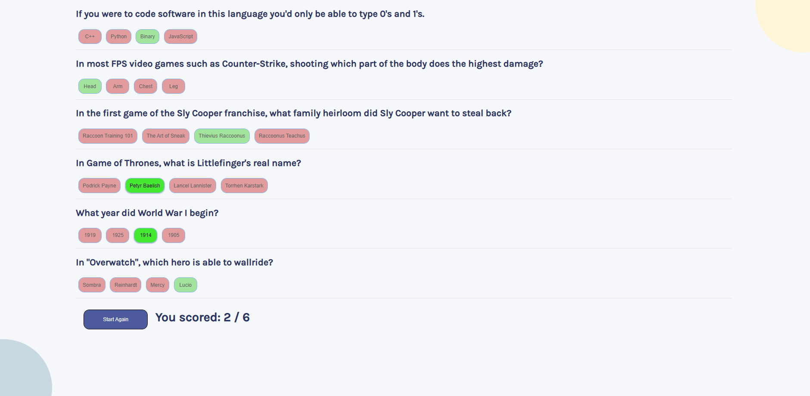

# Quizzical - built with React

## What I used to build this project

* React
* Trivia API (https://opentdb.com/api_config.php)
* CSS and HTML

## Available Scripts

In the project directory, you can run:

### `npm start`

Runs the app in the development mode.\
Open [http://localhost:3000](http://localhost:3000) to view it in your browser.

The page will reload when you make changes.\
You may also see any lint errors in the console.

##  👋

Thanks for checking out one of my projects

Completed by Margarita Busygina
Ottawa, Canada
June 2022
